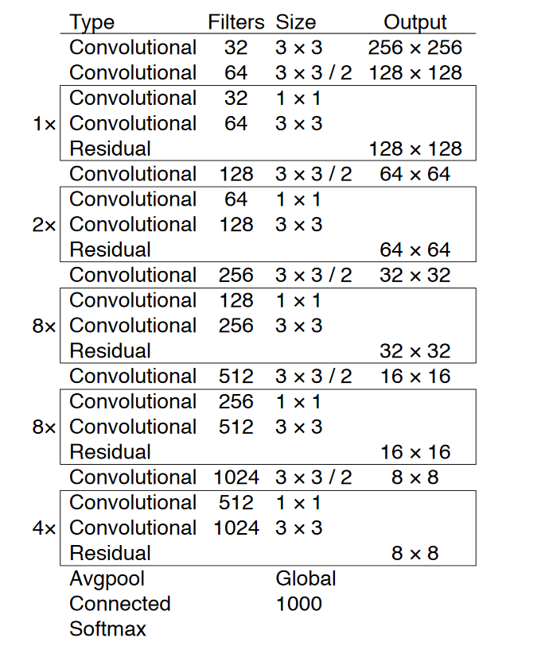
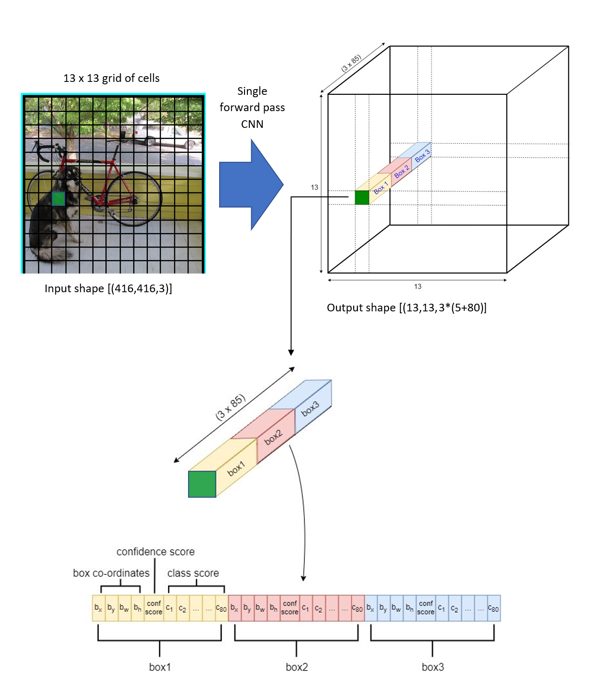
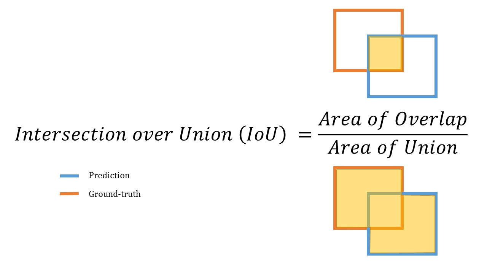
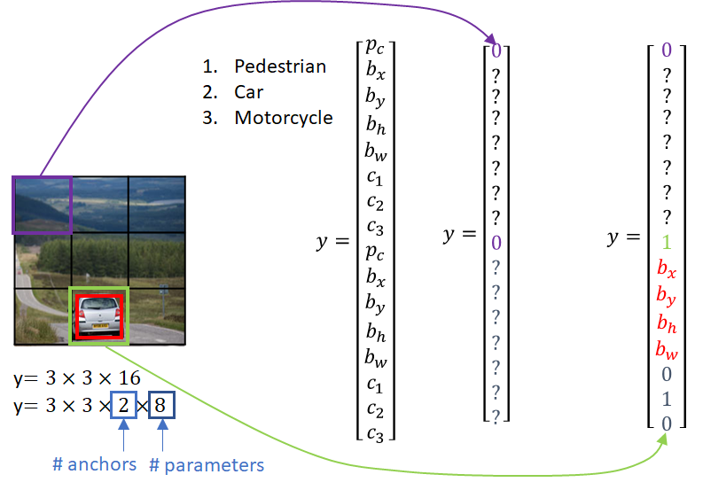
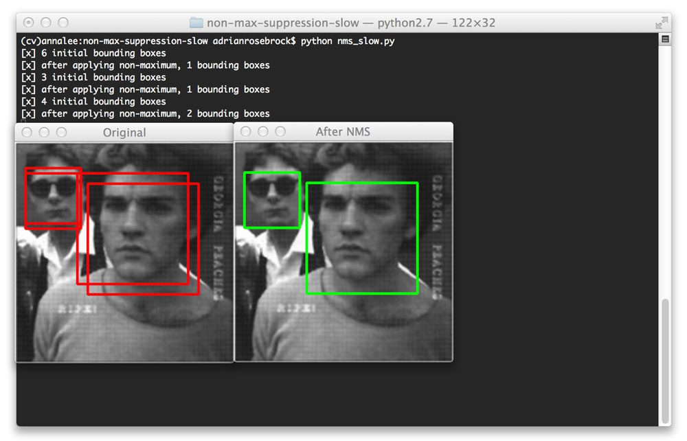

# Object detection using You Only Look Once (YOLO)  V3

"YOLO (You Only Look Once) is a modern method for object detection in images, which has the main advantage of being able to detect multiple objects in a single pass. Unlike other methods such as RCNN, which divide the image into multiple boxes and feed each box to a CNN for detection, YOLO works across the entire image at once. The first step in YOLO is to divide the image into SxS grids, where S is a hyperparameter that determines the size of the grid. For example, if S=19, the output will be a 19x19 grid, containing 361 individual cells. Each cell has multiple values, including a confidence score (pc) indicating whether the cell contains an object or not, as well as the center coordinates (cx, cy), width, and height of the object. In some cases, a grid cell may contain multiple object centers, for which anchor boxes are used. For example, a cell might have 3 or 4 anchor boxes. In this case, the output value will be (19x19,5, 3) or (361, 5 , 4), depending on the number of anchor boxes. The input to YOLO is an image, and the output is a tensor containing the predicted values for all grid cells and anchor boxes."

**YOLO Output**

1. Confidence score: This metric is used to indicate whether a given grid cell contains an object or not. The sigmoid function is typically used to convert the score into a value between 0 and 1, where a higher score indicates a higher likelihood of an object being present in the cell.

2. Box shapes (width, height): These parameters define the dimensions of the anchor box, which is a pre-defined rectangular region that is used to identify objects within an image. The width and height of the anchor box can vary depending on the specific application and image data being analyzed.

3. Box Centers (center x, center y): This metric specifies the center point of an object within the anchor box. It is typically used in conjunction with the box shape parameters to accurately locate and identify objects within an image.


The predicted center box value in YOLO is relative to the grid cell in which it lies. To get the actual value of the center box in the image, we multiply the predicted center box value (x,y) by the size of the grid cell, and then add the top-left corner of the corresponding grid cell. This calculation is done using the formulas:

* actual_x = (grid_x + predicted_x) * (image_width / grid_width)
* actual_y = (grid_y + predicted_y) * (image_height / grid_height)

where grid_x and grid_y are the indices of the grid cell in which the center box lies, predicted_x and predicted_y are the predicted center box values between 0 and 1, image_width and image_height are the dimensions of the input image, and grid_width and grid_height are the dimensions of the grid cells.


1. YOLO is based on a convoluted neural network using the ReLU leaky activation function. The number of CONV depends on the Yolo version; the first version comes with 24 convolutional layers, version 2 has 30 layers, and version 3 has 53. is faster than most of the trending object detection methods, such as RCNN, FRCNN, and sliding windows, but not very accurate.



2. In the YOLO (You Only Look Once) object detection algorithm, the input dataset is a set of images that can contain multiple objects, and the output is a tensor with the shape of (grids x grids x num_anchors x num_classes x 5).

Here is what each dimension of the output tensor represents:

* grids: the number of grids in the input image The image is divided into a grid of grids by grids cells.
* num_anchors: the number of anchor boxes used in the algorithm
* num_classes: the number of classes to be detected
* 5: The 5 elements in the tensor represent (x, y, w, h, confidence), where (x, y) is the center of the bounding box, (w, h) are the width and height of the bounding box, and (confidence) is the confidence score that the bounding box contains an object of any class.




3. The YOLO uses intersection over union (IoU) to compute the accuracy of the model. 

To compute the IoU for two box uses
    

```python
box1 (x11, y11, x12, y12)
box2 (x21, y21, x22, y22)

intersection = (max(x11, x21) - min(x12, x22)) * (max(y11, y21) - min(y12, y22))

box1_area = (x12 - x11) * (y12 - y11)
box2_area = (x22 - x21) * (y22 - y21)

union = box1_area + box2_area - intersection

IoU = intersection / union 
```



4. Anchor Box Algorithm
As previously stated, the YOLO algorithm divides the image into cells; if the image contains only one shape, the label file will contain grids x grids x PC and 4 for the bounding box; however, the cell can be the center of many other objects; thus, the label shape can have a bounding box for more than one object.



5. Non-Maximum Suppression
After a single forward pass through a convolutional neural network, the YOLO system generates multiple candidate bounding boxes for objects in the image. To eliminate unwanted bounding boxes and obtain the final set of predictions, non-maximum suppression (NMS) is applied. Firstly, all bounding boxes with a confidence score less than a specified threshold are eliminated. This threshold is used to discard bounding boxes that the system believes are unlikely to contain any object of interest. If there are multiple bounding boxes remaining that have a confidence score greater than the threshold, NMS computes the Intersection over Union (IoU) of each pair of boxes. For each object, only the bounding box with the highest IoU with the ground truth object is retained. This process ensures that each object in the image is detected only once and that the final set of predictions contains the most accurate and relevant bounding boxes.



